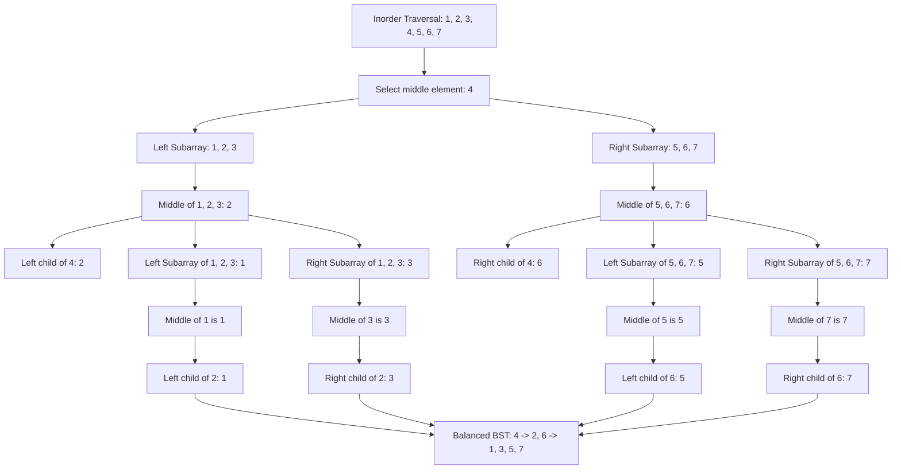

بص انت بتجيب middel وبعدين كل حاجة بتقسمها left and right 
Let's go through a detailed example step-by-step, explaining and visualizing the process of balancing a Binary Search Tree (BST). We will use the initial skewed BST shown in the image and convert it into a balanced BST.

### Example: Balancing the BST

#### Step 1: Initial Skewed BST

Given BST:
```
    1
     \
      2
       \
        3
         \
          4
           \
            5
             \
              6
               \
                7
```

#### Step 2: Inorder Traversal

Perform an inorder traversal of the BST to get a sorted array of the node values.

Inorder Traversal:
```
[1, 2, 3, 4, 5, 6, 7]
```

#### Step 3: Recursive Balancing

Use the sorted array to recursively construct a balanced BST.

1. **Select the middle element as the root**:
    - For the full array `[1, 2, 3, 4, 5, 6, 7]`, the middle element is `4`. So, `4` becomes the root.

2. **Divide the array into left and right subarrays**:
    - Left subarray: Elements before `4` -> `[1, 2, 3]`
    - Right subarray: Elements after `4` -> `[5, 6, 7]`

3. **Repeat the process for each subarray**:
    - For the left subarray `[1, 2, 3]`, the middle element is `2`. So, `2` becomes the left child of `4`.
    - For the right subarray `[5, 6, 7]`, the middle element is `6`. So, `6` becomes the right child of `4`.

4. **Continue dividing subarrays recursively**:
    - For `[1, 2, 3]`:
        - Left Subarray: `[1]` (Middle element: `1`, Left child of `2`)
        - Right Subarray: `[3]` (Middle element: `3`, Right child of `2`)
    - For `[5, 6, 7]`:
        - Left Subarray: `[5]` (Middle element: `5`, Left child of `6`)
        - Right Subarray: `[7]` (Middle element: `7`, Right child of `6`)

### Visualizing the Process

#### Step-by-Step Division and Construction

1. **Array**: `[1, 2, 3, 4, 5, 6, 7]`
    - Middle element: `4`
    - Root: `4`

2. **Left Subarray**: `[1, 2, 3]`
    - Middle element: `2`
    - Left child of `4`: `2`

3. **Right Subarray**: `[5, 6, 7]`
    - Middle element: `6`
    - Right child of `4`: `6`

4. **Further Division**:
    - For `[1, 2, 3]`:
        - Left Subarray: `[1]`
        - Middle element: `1`
        - Left child of `2`: `1`
        - Right Subarray: `[3]`
        - Middle element: `3`
        - Right child of `2`: `3`
    - For `[5, 6, 7]`:
        - Left Subarray: `[5]`
        - Middle element: `5`
        - Left child of `6`: `5`
        - Right Subarray: `[7]`
        - Middle element: `7`
        - Right child of `6`: `7`

### Mermaid Diagram

Here's a Mermaid diagram to visualize this process:



![[Pasted image 20240727055907.png]]
