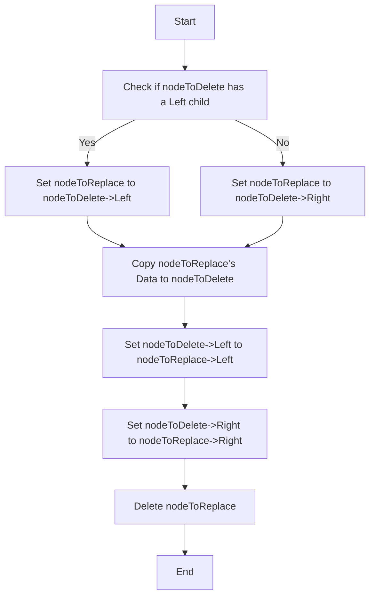

Here's a visualization of the `BSDelete_Has_One_Child` function, including a step-by-step explanation, with colors that are comfortable to the eye.

### Key Points:

- **Identify the node to delete**.
- **Determine the child (left or right) that will replace the node to delete**.
- **Update the node to delete with the data and children of the replacement node**.
- **Remove the replacement node**.

### Diagram:

### Explanation

1. **Start**: Begin the process of deleting a node with one child.
2. **Check if nodeToDelete has a Left child**: Determine whether the node to delete has a left child.
    - **Yes**: If the node has a left child, set `nodeToReplace` to the left child.
    - **No**: If the node does not have a left child, set `nodeToReplace` to the right child.
3. **Copy nodeToReplace's Data to nodeToDelete**: Replace the data of `nodeToDelete` with the data of `nodeToReplace`.
4. **Set nodeToDelete->Left to nodeToReplace->Left**: Update the left child pointer of `nodeToDelete` to point to the left child of `nodeToReplace`.
5. **Set nodeToDelete->Right to nodeToReplace->Right**: Update the right child pointer of `nodeToDelete` to point to the right child of `nodeToReplace`.
6. **Delete nodeToReplace**: Remove the `nodeToReplace` node from memory.
7. **End**: Complete the deletion process.