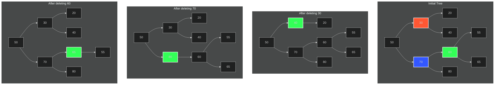

### Deleting 30:
- Node to delete: 30 (orange in Initial Tree)
- In-order successor: 40 (right child of 30)
- Process:
    1. Find 40 as the successor (smallest in the right subtree of 30)
    2. Replace 30's data with 40
    3. Update 30's right pointer to 40's right child (null in this case)
    4. Delete the original 40 node
- Result: 40 takes 30's place, and its left child (20) remains in place

### Deleting 70:
- Node to delete: 70 (blue in Initial Tree)
- In-order successor: 80 (right child of 70)
- Process:
    1. Find 80 as the successor (smallest in the right subtree of 70)
    2. Replace 70's data with 80
    3. Update 70's right pointer to 80's right child (null in this case)
    4. Delete the original 80 node
- Result: 80 takes 70's place, and 70's left subtree (60 and its children) remains unchanged

### Deleting 60:
- Node to delete: 60 (green in Initial Tree)
- In-order successor: 65 (smallest in the right subtree of 60)
- Process:
    1. Find 65 as the successor
    2. Replace 60's data with 65
    3. Update 60's right pointer to 65's right child (null in this case)
    4. Delete the original 65 node
- Result: 65 takes 60's place, and 60's left child (55) remains in place

    <strong>Key points:</strong>
    <ul>
        <li><strong>In each case, we find the smallest node in the right subtree of the node to delete.</strong></li>
        <li><strong>We replace the data of the node to delete with the data from the successor.</strong></li>
        <li><strong>We then remove the successor from its original position.</strong></li>
        <li><strong>This process maintains the BST property: all nodes in the left subtree are smaller, and all nodes in the right subtree are larger than the new node.</strong></li>
    </ul>

