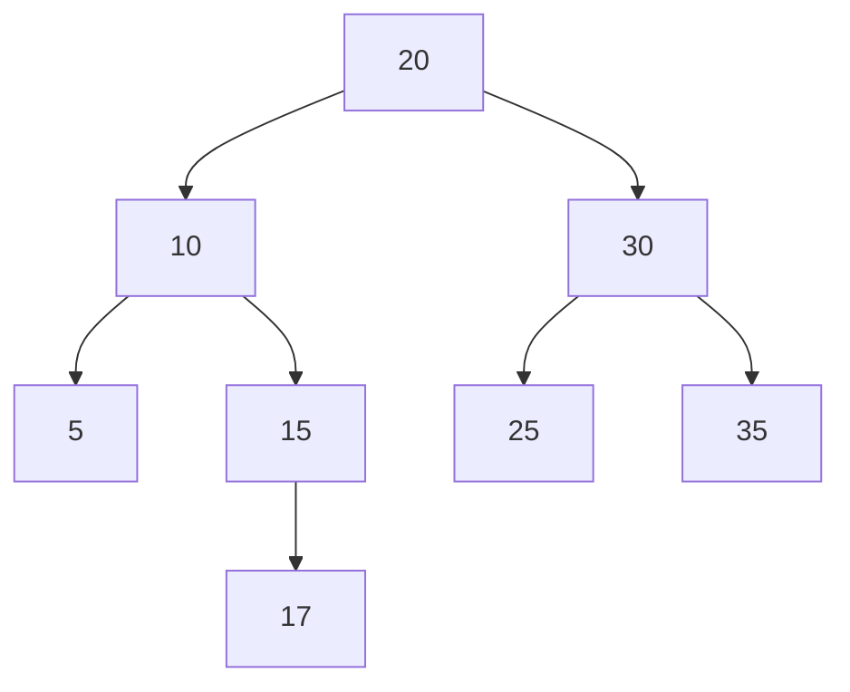
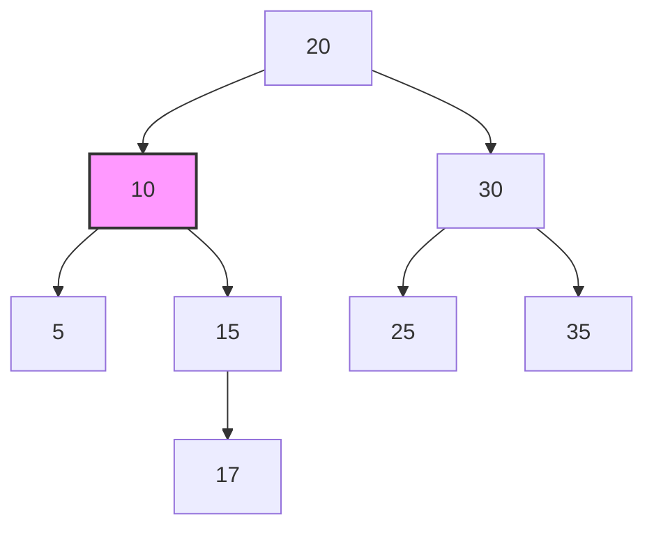
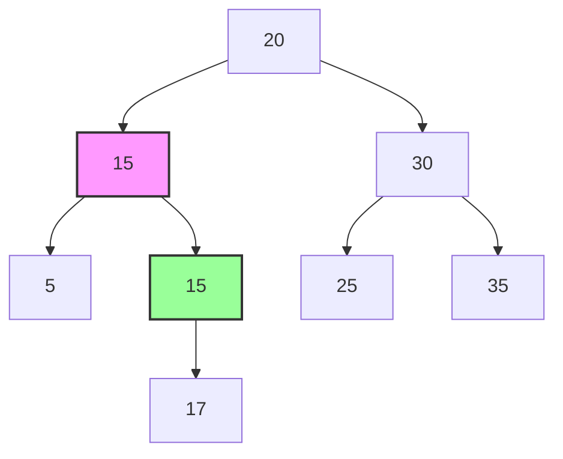
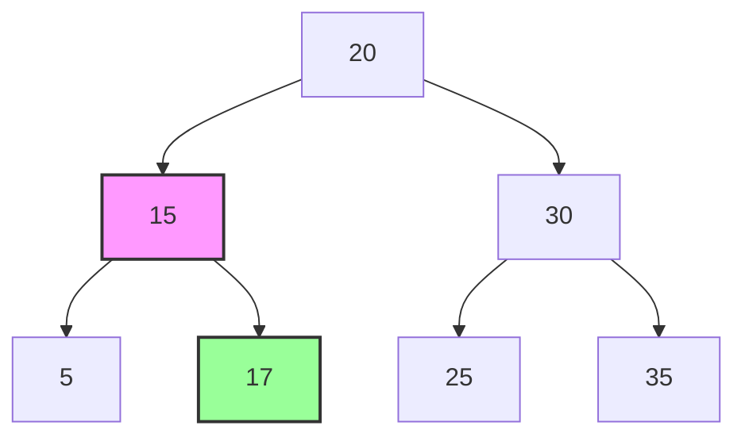

Let's visualize the step-by-step process of deleting a node with two children in a binary search tree (BST) by finding and using the inorder successor. We'll use the previously mentioned example BST:

```
      20
     /  \
    10   30
   / \   / \
  5  15 25  35
        \
         17
```

Let's delete node 10.

### Step-by-Step Process:

1. **Identify the node to delete**:
   - We want to delete node 10.

2. **Find the inorder successor of node 10**:
   - Node 10 has a right child (node 15).
   - Move to the right child (node 15) and then find the leftmost node in its subtree.
   - The leftmost node in the subtree of node 15 is node 15 itself since node 15 has no left child but has a right child (node 17).

3. **Replace node 10 with its inorder successor (node 15)**:
   - We copy the data of node 15 to node 10.

4. **Delete the original node 15**:
   - Since node 15 (the original) has a right child (node 17) but no left child, we replace node 15 with its right child (node 17).

Let's visualize this step-by-step using a mermaid diagram.

### Initial BST


### Step 1: Identify Node 10 to Delete


### Step 2: Find the Inorder Successor (Node 15)


### Step 3: Replace Node 10 with Inorder Successor (Node 15)


### Step 4: Delete the Original Node 15 and Adjust Pointers


### Explanation of Each Step:

1. **Identify Node to Delete**:
   - We want to delete node 10 (highlighted in pink).

2. **Find the Inorder Successor**:
   - Node 15 (highlighted in green) is the inorder successor of node 10.
   - It is the smallest node greater than node 10, found by moving to the right child and then to the leftmost node in the right subtree.

3. **Replace Node 10 with Inorder Successor**:
   - Copy the data of node 15 to node 10, effectively making node 15 the new node 10.

4. **Delete Original Node 15**:
   - Since node 15 has a right child (node 17) but no left child, we replace node 15 with its right child.
   - Adjust the pointer of node 10's right child to point to node 17.
