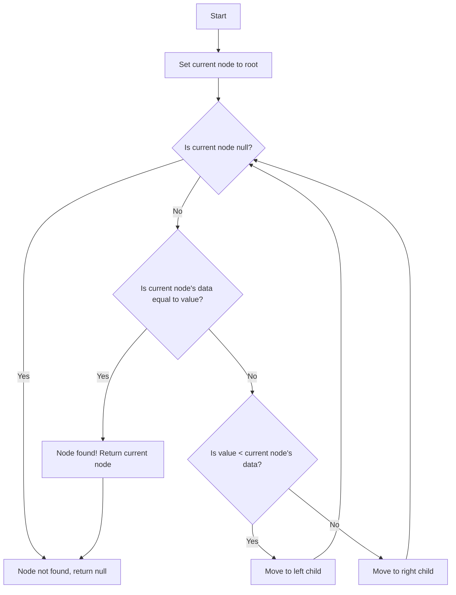

```mermaid
flowchart TD
    A[Start] --> B[Set current node to root]
    B --> C{Is current node null?}
    C -- Yes --> D[Node not found, return null]
    C -- No --> E{Is current node's data equal to value?}
    E -- Yes --> F[Node found! Return current node]
    E -- No --> G{Is value < current node's data?}
    G -- Yes --> H[Move to left child]
    G -- No --> I[Move to right child]
    H --> C
    I --> C
    F --> D

```

