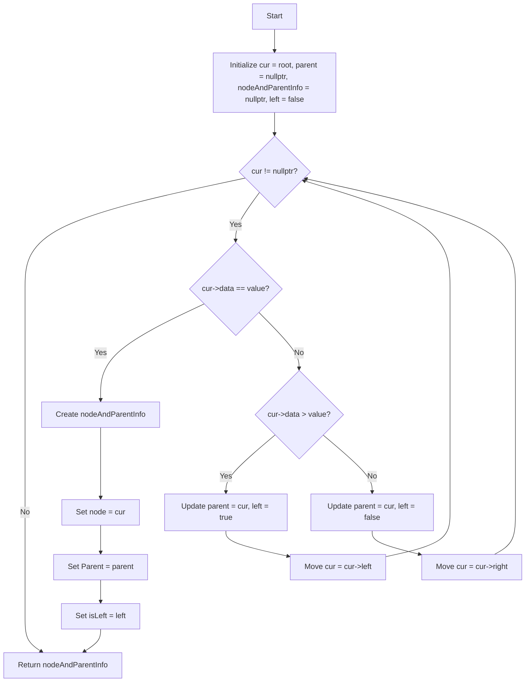

```mermaid
flowchart TD
    A[Start] --> B[Initialize cur = root, parent = nullptr, nodeAndParentInfo = nullptr, left = false]
    B --> C{cur != nullptr?}
    C -- No --> D[Return nodeAndParentInfo]
    C -- Yes --> E{cur->data == value?}
    E -- Yes --> F[Create nodeAndParentInfo]
    F --> G[Set node = cur]
    G --> H[Set Parent = parent]
    H --> I[Set isLeft = left]
    I --> D
    E -- No --> J{cur->data > value?}
    J -- Yes --> K[Update parent = cur, left = true]
    K --> L[Move cur = cur->left]
    J -- No --> M[Update parent = cur, left = false]
    M --> N[Move cur = cur->right]
    L --> C
    N --> C

```

