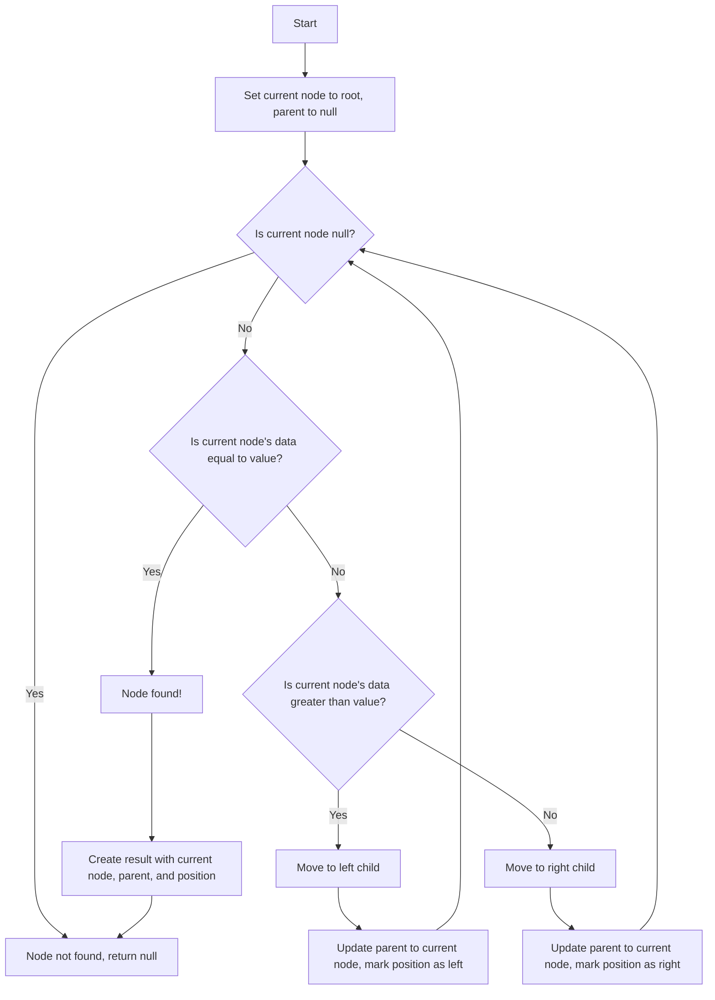

```mermaid
flowchart TD
    A[Start] --> B[Set current node to root, parent to null]
    B --> C{Is current node null?}
    C -- Yes --> D[Node not found, return null]
    C -- No --> E{Is current node's data equal to value?}
    E -- Yes --> F[Node found!]
    F --> G[Create result with current node, parent, and position]
    G --> D
    E -- No --> H{Is current node's data greater than value?}
    H -- Yes --> I[Move to left child]
    I --> J[Update parent to current node, mark position as left]
    J --> C
    H -- No --> K[Move to right child]
    K --> L[Update parent to current node, mark position as right]
    L --> C
```
