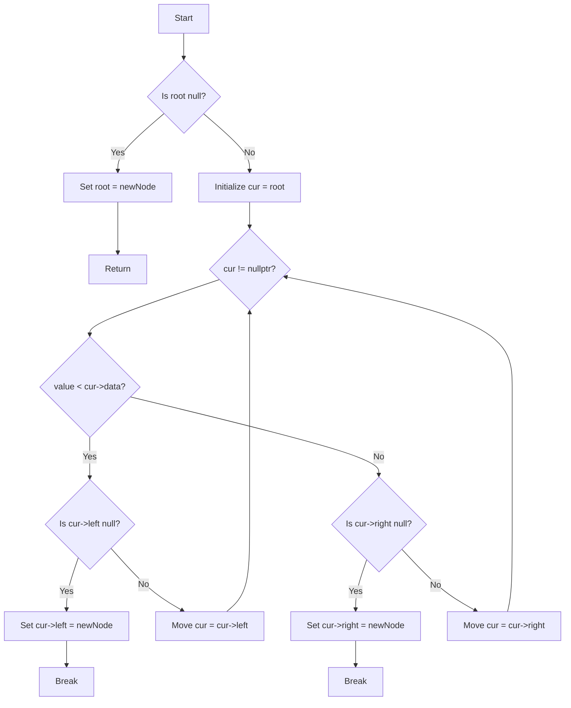

```mermaid
flowchart TD
    A[Start] --> B{Is root null?}
    B -- Yes --> C[Set root = newNode]
    C --> D[Return]
    B -- No --> E[Initialize cur = root]
    E --> F{cur != nullptr?}
    F --> G{value < cur->data?}
    G -- Yes --> H{Is cur->left null?}
    H -- Yes --> I[Set cur->left = newNode]
    I --> J[Break]
    H -- No --> K[Move cur = cur->left]
    K --> F
    G -- No --> L{Is cur->right null?}
    L -- Yes --> M[Set cur->right = newNode]
    M --> N[Break]
    L -- No --> O[Move cur = cur->right]
    O --> F
```

