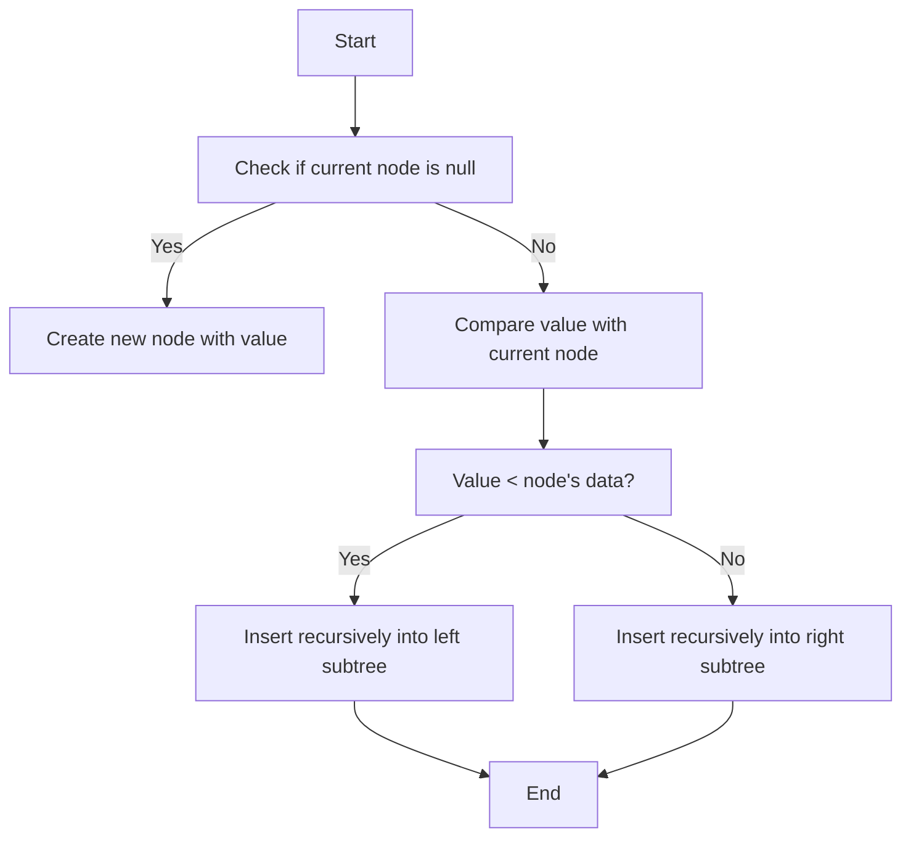

```mermaid
flowchart TD
    A[Start] --> B[Check if current node is null]
    B -->|Yes| C[Create new node with value]
    B -->|No| D[Compare value with current node]
    D --> E[Value < node's data?]
    E -->|Yes| F[Insert recursively into left subtree]
    E -->|No| G[Insert recursively into right subtree]
    F --> H[End]
    G --> H[End]

```

