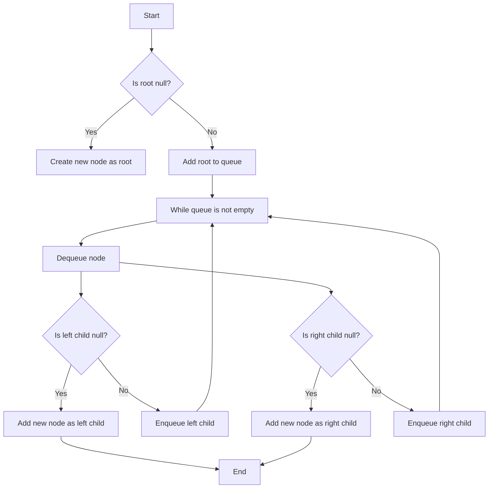

```mermaid
flowchart TD
    A[Start] --> B{Is root null?}
    B -->|Yes| C[Create new node as root]
    B -->|No| D[Add root to queue]
    D --> E[While queue is not empty]
    E --> F[Dequeue node]
    F --> G{Is left child null?}
    G -->|Yes| H[Add new node as left child]
    G -->|No| I[Enqueue left child]
    F --> J{Is right child null?}
    J -->|Yes| K[Add new node as right child]
    J -->|No| L[Enqueue right child]
    H --> M[End]
    I --> E
    K --> M
    L --> E

```

