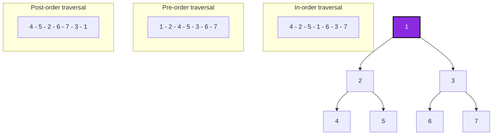

```mermaid
graph TD
    A[1] --> B[2]
    A --> C[3]
    B --> D[4]
    B --> E[5]
    C --> F[6]
    C --> G[7]

  style A fill:#8A2BE2,stroke:#000,stroke-width:4px, color:#fff style B fill:#1E90FF,stroke:#000,stroke-width:3px, color:#fff style D fill:#32CD32,stroke:#000,stroke-width:2px, color:#fff style E fill:#32CD32,stroke:#000,stroke-width:2px, color:#fff style C fill:#FF4500,stroke:#000,stroke-width:2px, color:#fff style F fill:#FF4500,stroke:#000,stroke-width:2px, color:#fff style G fill:#FF4500,stroke:#000,stroke-width:2px, color:#fff

    subgraph "In-order traversal"
    IO[4 - 2 - 5 - 1 - 6 - 3 - 7]
    end

    subgraph "Pre-order traversal"
    PRE[1 - 2 - 4 - 5 - 3 - 6 - 7]
    end

    subgraph "Post-order traversal"
    POST[4 - 5 - 2 - 6 - 7 - 3 - 1]
    end
```

