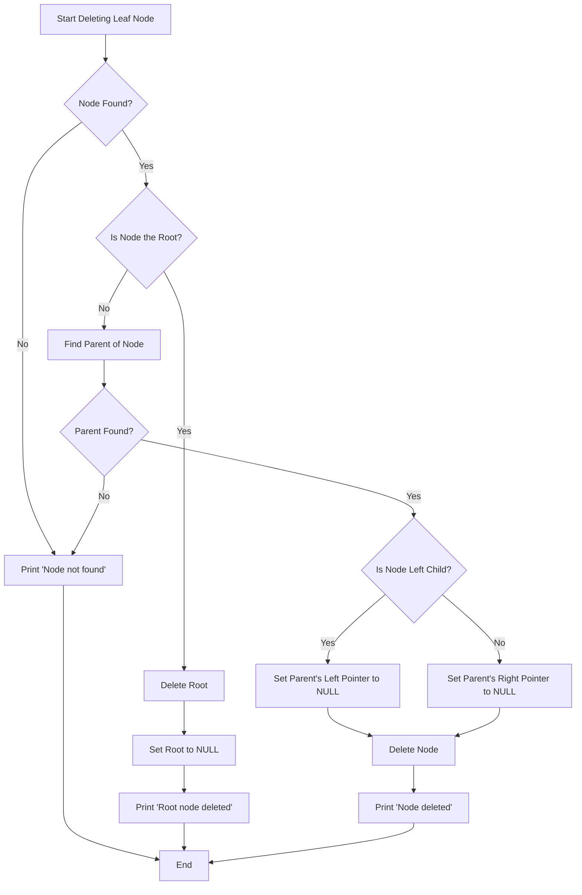

Here’s the updated Mermaid diagram for the `delete_child_helper` function:

This flowchart illustrates how the `delete_child_helper` function proceeds, checking whether the node is the root, adjusting parent pointers, and deleting the node when it's a leaf.