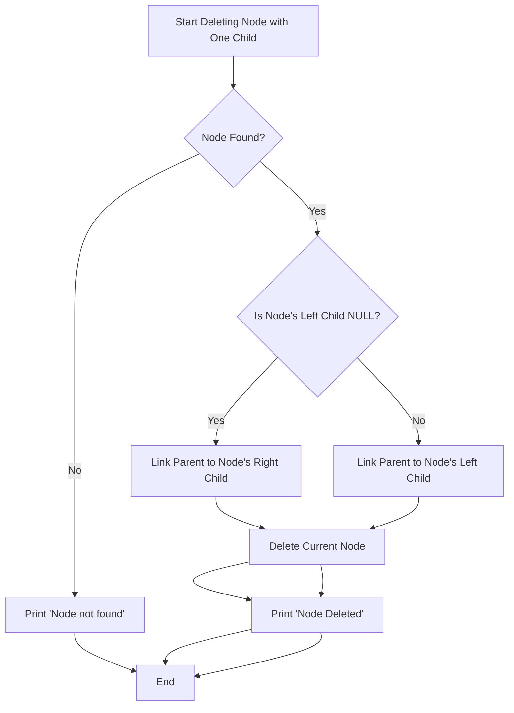

### Step-by-step Explanation:
1. **Start**: Begin the process of deleting the node with one child.
2. **Check if Node Exists**: If the node isn’t found, print an error message and end.
3. **Check Left Child**: If the node has no left child (i.e., `left == nullptr`), link the parent to the right child.
4. **Check Right Child**: If the node has no right child (i.e., `right == nullptr`), link the parent to the left child.
5. **Delete Node**: Once the parent is correctly linked to the child, delete the current node.
6. **Print Confirmation**: Print a confirmation message that the node has been deleted.

This logic applies to cases where the node has exactly one child.