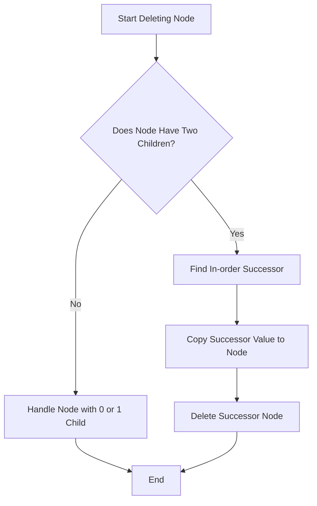

Certainly! Here is a mermaid flowchart that represents the process of deleting a node with two children in a binary search tree:

This flowchart shows the steps involved:

1. **Start**: Begin the process of deleting the node.
2. **Check if the node has two children**: If not, handle cases for 0 or 1 child. If yes, proceed.
3. **Find the in-order successor**: This is the smallest node in the right subtree.
4. **Replace the node's value**: Replace the value of the node to be deleted with that of the in-order successor.
5. **Delete the successor node**: Now delete the successor node, which will have at most one child.
6. **End**: The deletion process is complete.
[[BTS in-order successor]]
